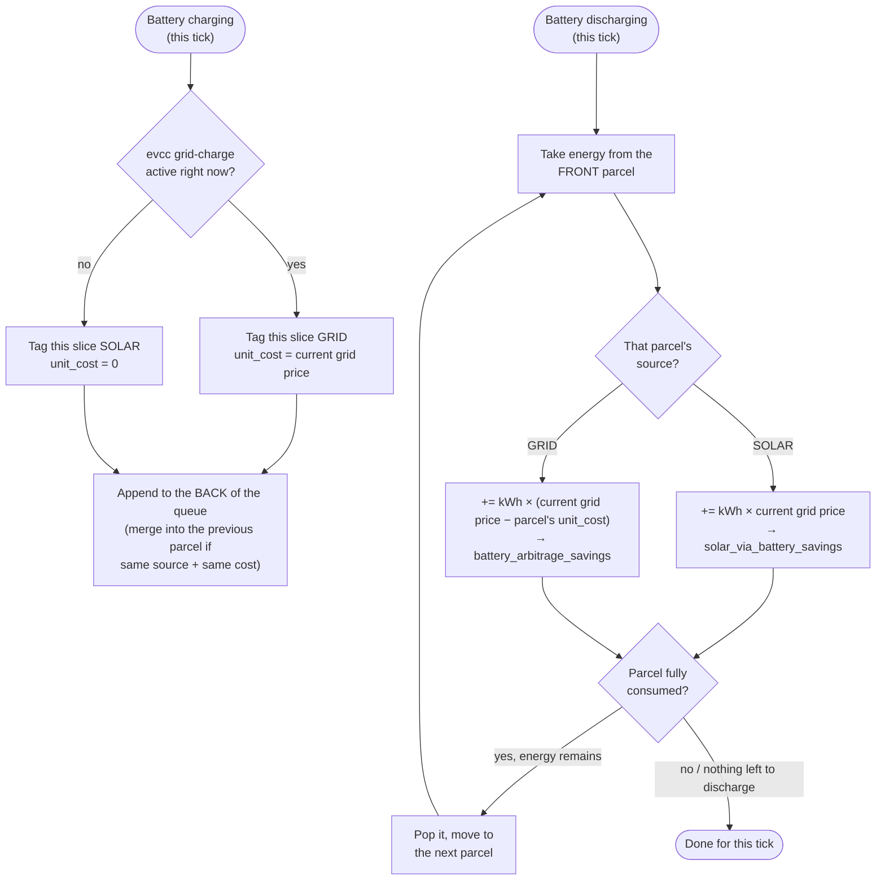

# Solar Savings

<br clear="left" />

A Home Assistant custom integration that tracks money saved by a solar +
battery system, valued at real grid pricing — not just "how much solar did I
make," but "how much did that actually save me, and how much did the battery
save me separately by buying grid energy cheap and using it when it's
expensive."

## Why this exists

A solar+battery system with a dynamically-priced grid (Nord Pool / Energi
Data Service in this case) produces savings from several distinct sources,
and a home battery that can be charged from *either* solar surplus *or* the
grid (for price arbitrage) means every kWh leaving the battery has to be
traced back to where it came from before it can be valued correctly. See
[`custom_components/solar_savings/ledger.py`](custom_components/solar_savings/ledger.py)
for the accounting model (a FIFO queue of energy "parcels," each tagged with
its source and, for grid parcels, the price paid).

## How the FIFO ledger works

Every charge appends a "parcel" to the **back** of a queue (tagged with
where the energy came from, and its cost if it came from the grid). Every
discharge consumes energy from the **front** of that same queue — so energy
is credited to whichever stream it actually came from, in the order it was
actually stored, instead of an approximate "solar vs. grid" ratio for the
whole battery.



Walking through it with concrete numbers (this is exactly what
[`tests/test_ledger.py`](tests/test_ledger.py)'s
`test_discharge_consumes_parcels_in_fifo_order` asserts):

```
1. charge_battery(2.0 kWh, SOLAR, cost=0)
   queue:  [ SOLAR 2.0 kWh ]
            front ────────── back

2. charge_battery(3.0 kWh, GRID, cost=1.00 DKK/kWh)
   queue:  [ SOLAR 2.0 kWh ][ GRID 3.0 kWh @1.00 ]
            front ──────────────────────── back

3. discharge_battery(1.0 kWh, grid_price=2.00)
   → takes 1.0 kWh off the FRONT parcel (SOLAR)
   → solar_via_battery_savings += 1.0 × 2.00 = 2.00 DKK
   queue:  [ SOLAR 1.0 kWh ][ GRID 3.0 kWh @1.00 ]

4. discharge_battery(2.0 kWh, grid_price=2.00)
   → finishes the SOLAR parcel (1.0 kWh left): += 1.0 × 2.00 = 2.00 DKK
     (solar_via_battery_savings now 4.00 DKK total) — parcel emptied, popped
   → spills into the GRID parcel for the remaining 1.0 kWh:
     battery_arbitrage_savings += 1.0 × (2.00 − 1.00) = 1.00 DKK
   queue:  [ GRID 2.0 kWh @1.00 ]

Result: solar_via_battery_savings = 4.00 DKK, battery_arbitrage_savings =
1.00 DKK — each kWh landed in the stream it actually came from.
```

`battery_solar_fraction` and `battery_grid_charge_cost_basis` (the two
diagnostic sensors) are just read-outs of what's currently sitting in the
queue at any given moment — e.g. after step 4 above, the queue is 100% GRID
at a 1.00 DKK/kWh cost basis, so `battery_solar_fraction` would read `0.0`.

## Daily/weekly/monthly/yearly rollover

[`periods.py`](custom_components/solar_savings/periods.py) tracks the four
`sensor.total_system_savings_*` entities the same way the ledger tracks
money: a small, dependency-free, unit-tested class (`tests/test_periods.py`)
that `engine.py` feeds on every tick. For each period it remembers a
**baseline** — the value `total_system_savings` had when the current
day/week/month/year started — and reports `total_system_savings − baseline`.
When the calendar rolls over (checked against *local* time, so "daily" means
local midnight, not UTC), the baseline resets to whatever the total is at
that moment, and the period starts counting from zero again. "Weekly" uses
the ISO week (Monday start) — note that this doesn't always line up with
"yearly": the ISO week containing Jan 1st can belong to the previous
calendar year (`tests/test_periods.py` has a rollover test built around
exactly that case).

## Entities created

| Entity | Unit | What it means |
|---|---|---|
| `sensor.solar_direct_savings` | DKK | Solar used immediately by the house, valued at grid price at time of use |
| `sensor.solar_via_battery_savings` | DKK | Solar stored then discharged later, valued at grid price at time of discharge |
| `sensor.total_solar_savings` | DKK | The two above, combined — "how much has solar saved me" |
| `sensor.battery_arbitrage_savings` | DKK | Grid energy bought cheap, stored, discharged when the price was higher |
| `sensor.total_system_savings` | DKK | Solar savings + arbitrage savings — everything the system has saved, regardless of source |
| `sensor.solar_export_revenue` | DKK | Energy fed back to the grid, valued at the export/compensation price. Revenue, not a saving — kept separate on purpose |
| `sensor.total_system_savings_daily` | DKK | `total_system_savings`, but reset to the value it had at local midnight today |
| `sensor.total_system_savings_weekly` | DKK | Same, reset at the start of the current ISO week (Monday) |
| `sensor.total_system_savings_monthly` | DKK | Same, reset on the 1st of the current month |
| `sensor.total_system_savings_yearly` | DKK | Same, reset on Jan 1st of the current year |
| `sensor.battery_solar_fraction` | ratio 0–1 | Diagnostic: share of what's currently in the battery that's solar-origin |
| `sensor.battery_grid_charge_cost_basis` | DKK/kWh | Diagnostic: weighted-average price paid for the grid-origin energy currently in the battery |

All money entities are `device_class: monetary`, `state_class: total` — they
accumulate over time like the others, but `battery_arbitrage_savings` (and
anything summing it, including the four period sensors above) can
legitimately decrease within a period after a losing arbitrage trade
(grid-charged energy discharged once the price has dropped below what was
paid for it), so `total_increasing` would be both rejected by Home Assistant
and semantically wrong. For the other four money entities (which only ever
go up), HA's own History/Statistics graphs already give daily/monthly/yearly
breakdowns for free — the four period sensors exist specifically for
`total_system_savings` because a dashboard tile wanting "how much has this
saved me this month" shouldn't require opening the Statistics view.

## Configuration

Added via **Settings → Devices & Services → Add Integration → Solar
Savings**. The setup form asks for seven entities (all pre-filled with
sensible defaults, all EntitySelector fields so nothing is hardcoded):

| Field | Default |
|---|---|
| Solar power | `sensor.pv_power` |
| Battery charge power | `sensor.battery_charge` |
| Battery discharge power | `sensor.battery_discharge` |
| Grid feed-in (export) power | `sensor.feed_in` |
| Grid import price | `sensor.energi_data_service` |
| Export / compensation price | `sensor.energi_data_service_raw` |
| Battery grid-charge indicator | `binary_sensor.evcc_battery_grid_charge_active` |

The defaults match a FoxESS inverter + evcc + Energi Data Service setup; any
field can point at different entities for a different inverter/pricing
integration, as long as the power entities are in kW and the price entities
are in currency/kWh.

## Installation

**HACS (recommended):** this repo is mirrored to
[`github.com/mbedk/ha-solar-savings`](https://github.com/mbedk/ha-solar-savings)
specifically so HACS can use it — HACS's "add custom repository" flow
expects a GitHub URL, which the self-hosted source repo alone wouldn't
satisfy. Add `https://github.com/mbedk/ha-solar-savings` as a custom
repository, category "Integration," then install and restart Home
Assistant.

**Manual:** copy `custom_components/solar_savings/` into your Home
Assistant `config/custom_components/` directory, restart Home Assistant,
then add the integration from the UI.

## Development

The core accounting logic (`ledger.py`) has no Home Assistant dependency and
is unit tested on its own:

```sh
python3 -m unittest discover -s tests -v
```

`engine.py` is the thin Home Assistant-facing layer: it listens for state
changes on the configured entities (plus a ~30s backstop timer, matching
`evcc_intg`'s own poll cadence, for sensors that hold steady and never fire a
state-changed event), does the power→energy integration, feeds the ledger,
persists it via Home Assistant's `Store` helper, and notifies the sensor
platform.

### Known limitation

The battery grid-charge indicator can lag the real charge-source switch by
up to one poll cycle of whatever integration provides it (~30s for
`evcc_intg`, confirmed empirically). For a charge/discharge event lasting
minutes to hours this misattributes a negligible sliver of energy at the
boundary.
